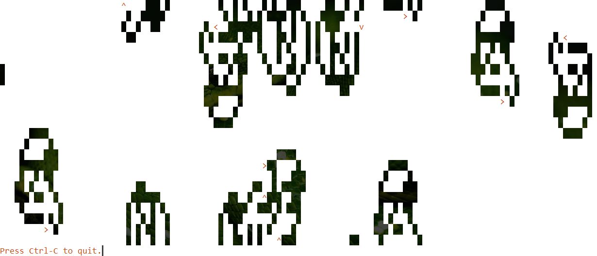

# Langton's Ant Simulation

Dive into the fascinating world of cellular automata with Langton's Ant Simulation. Explore the intriguing emergent behavior that arises from deceptively simple rules as you simulate the movement of an ant on a two-dimensional grid. In this mesmerizing simulation, an ant begins its journey on a grid cell with one of two colors. The ant's behavior is governed by straightforward rules: if it starts on the first color, it changes it to the second color, turns 90 degrees to the right, and moves forward one cell. If it starts on the second color, it changes it to the first color, turns 90 degrees to the left, and advances one cell.

Despite its simplicity, Langton's Ant exhibits complex and captivating behavior as it traverses the grid. This program offers the flexibility to model multiple ants in the same space, creating intriguing interactions when their paths intersect. Developed by computer scientist Chris Langton in 1986, Langton's Ant continues to captivate and inspire curiosity.

## How to Simulate

1. Run the program in a compatible environment.
2. Observe as the ants move on the grid, following the rules of Langton's Ant.
3. Experiment with multiple ants to witness their interactions and emergent behavior.

## Features

- Experience the mesmerizing behavior of Langton's Ant in a cellular automaton.
- Simulate the movement of ants on a two-dimensional grid with simple yet captivating rules.
- Observe complex emergent behavior as ants traverse the grid.

## Instructions

1. Open a terminal or command prompt.
2. Navigate to the program's directory.
3. Run the program using `python langtons_ant.py`.
4. Observe the movement of ants on the grid and experiment with different scenarios.

## Sample Output

## Note

Langton's Ant Simulation offers a captivating exploration of cellular automata and the emergent behavior that arises from basic rules. Dive into the world of computational curiosity and discover the captivating journey of Langton's Ant.

*Note: For more information about Langton's Ant, visit the Wikipedia article [here](https://en.wikipedia.org/wiki/Langton%27s_ant).*
